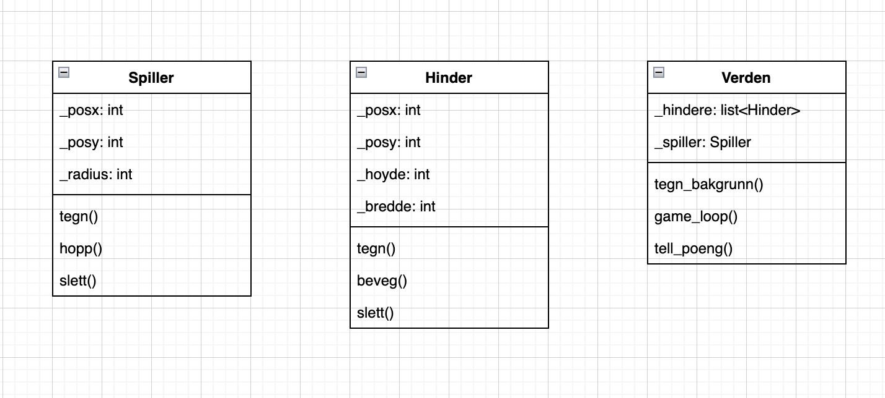

# Objektorienterte modeller som beskriver programstruktur

## UML-diagram

Vi bruker UML diagram for å planlegge prosjekter innenfor opbejktorienterte programmer. Man lager en oversikt over hvilke klasser man skal bruke, og deretter gir man klassene egenskaper og metoder som skal brukes i klassen. 

